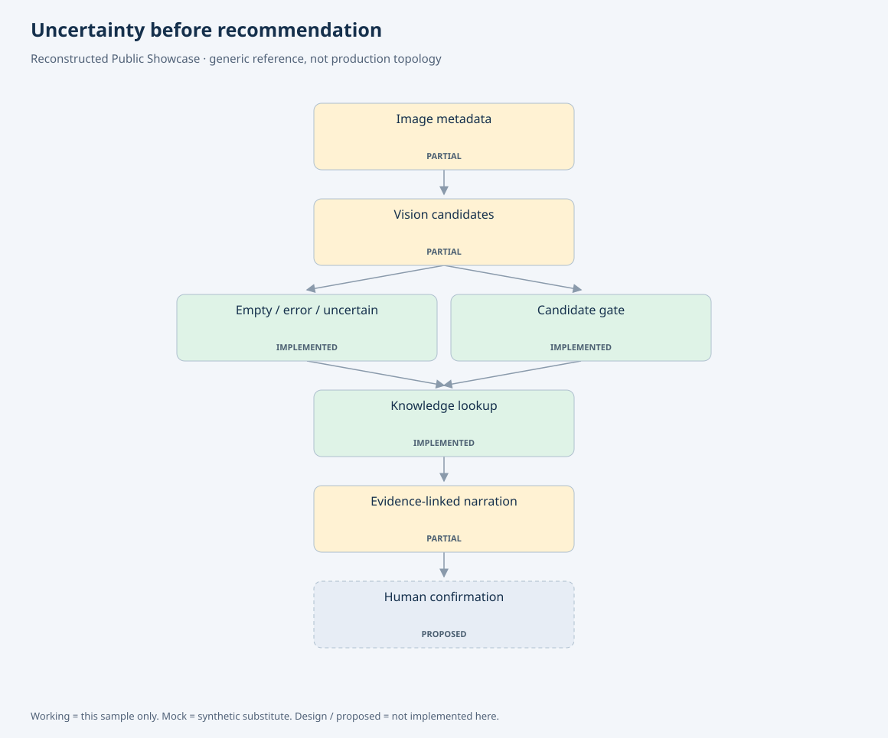
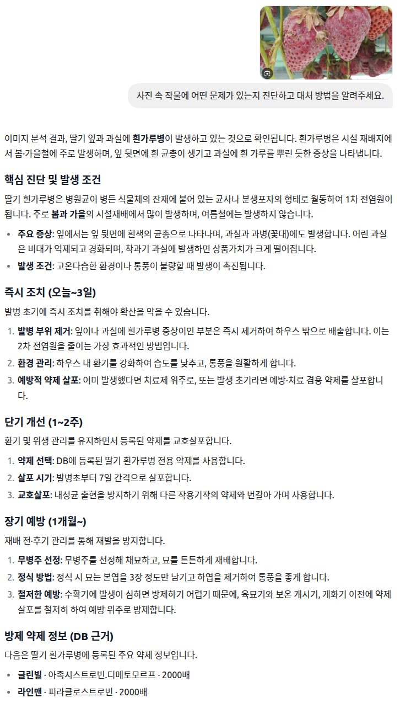
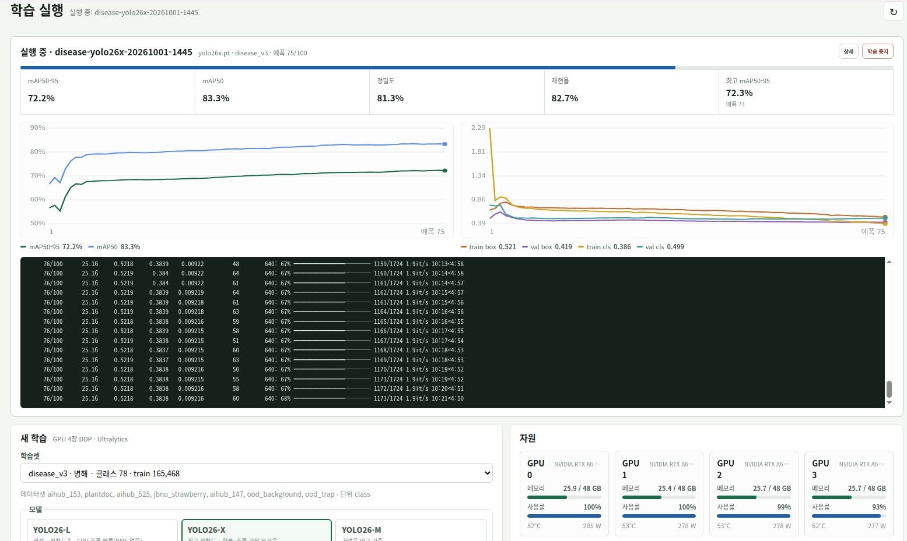
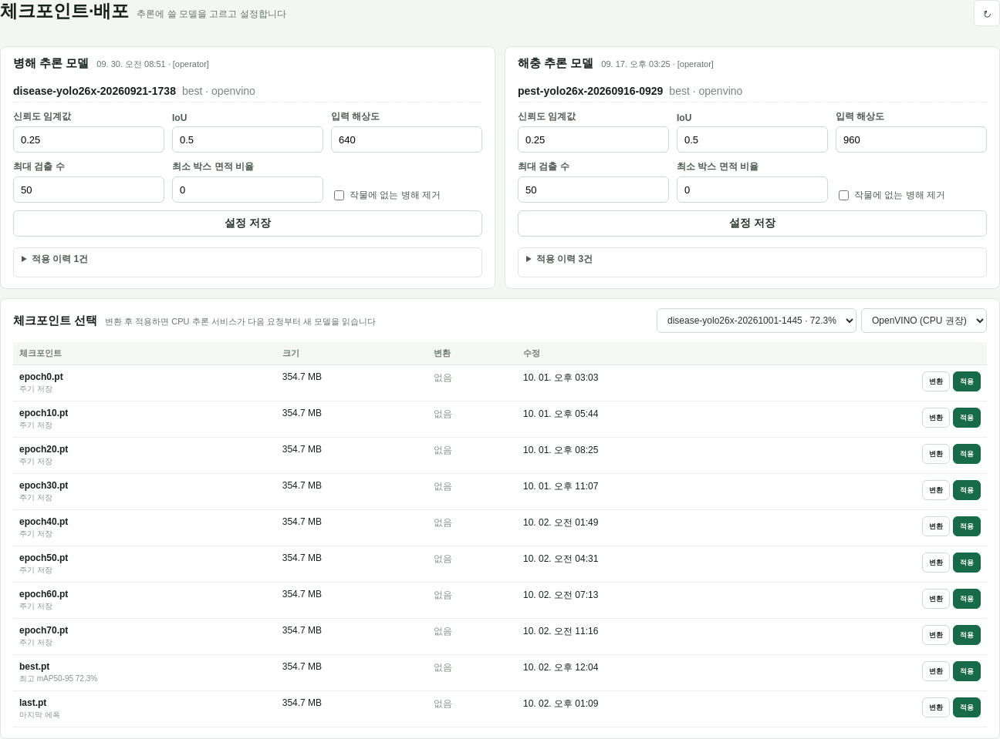
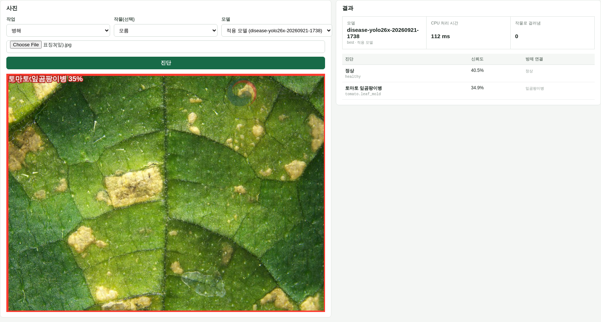

# Multimodal Domain AI

### Image → YOLO → Structured Evidence → Consultation

[](https://github.com/YeongjoonKim/multimodal-domain-ai/actions/workflows/ci.yml)

## 실제 구현

상담에 첨부된 이미지를 병해·해충 YOLO 도구로 분석하고, 작물·병해충 표준명과
공식 등록정보 검색을 거쳐 상담 근거로 전달하는 파이프라인을 구현했습니다.
이미지 모델의 후보와 약제·사용기준을 설명하는 답변의 책임을 분리했습니다.

```text
Image + Question → Disease / Pest Inference → Taxonomy Mapping
                                                    ↓
Diagnosis Card / Answer ← SSE ← LLM Consultation ← Structured Evidence
```

## Model & Integration Facts

| 항목 | 구성 및 구현 |
|---|---|
| Vision Task | 작물 사진의 병해·해충 후보 분석과 상담 근거 연결 |
| Model Family | 병해·해충 YOLO 모델을 독립 도구로 구성 |
| Training Evidence | YOLO26-X 병해 모델 학습 run의 지표·로그·GPU 모니터링 |
| Training Dataset | disease_v3 · 78 classes · train 165,468 images |
| Training Evidence Scope | disease_v3 학습 run의 지표·checkpoint; 아래 학습 캡처는 75/100 시점 |
| Current Inference | CPU Vision inference service; 학습 증거 화면과는 별도 active run |
| Taxonomy | 모델 label→작물·NCPMS 병해충 표준명 매핑 |
| Evidence Integration | 작물·병해충이 식별되면 공식 등록정보를 조회해 상담 문맥에 결합 |
| Agent Integration | 병해·해충 비동기 호출→후보 정리→기존 검색·생성·검증 경로 |
| UI Delivery | SSE의 vision 결과→사진 진단 카드, 답변 본문의 근거 설명 |
| Failure Handling | 분기별 성공 결과 유지, 빈 검출·모호한 후보·서비스 오류 구분 |

[모델·학습 run·상담 연결의 상세 근거](docs/actual-engineering.md).



## 상담 연결 — Consultation Integration



사진과 질문을 제출하면 증상 설명과 즉시 조치·단기 개선·장기 예방을 문단·목록으로 확인합니다.
캡처에는 약제 정보가 표시되는 답변 구간도 포함돼 있습니다.

[턴별 카드 연결과 답변 검증 범위](docs/consultation-evidence.md).

사진 진단 카드는 **이미지에서 본 후보와 신뢰 수준**을 표시합니다.
등록 약제·희석배수·사용시기·안전사용기준은 답변 본문의 공식 검색 근거에서 설명합니다.
이 검색·상담 연결은 구현돼 있습니다. 다만 공개 캡처의 개별 약제명·수치가 현재 등록 행과
일치하는지 확인하는 작업은 별도의 답변 검증 범위입니다.

## YOLO 학습 — Training Monitoring



YOLO26-X의 epoch, mAP, precision/recall, loss와 4개 GPU 상태를 모니터링합니다.
이 화면은 학습 중간인 epoch 75/100 기록입니다.

이 학습 run과 아래 CPU 추론에 적용된 active run은 별도로 관리합니다.

## 모델 변환·배포 — Model Lifecycle



관리자에서 병해·해충별 활성 모델과 checkpoint의 ONNX/OpenVINO 변환 상태를 확인합니다.
GPU 학습과 CPU 추론은 별도 서비스이며, 새 학습 run을 선택해도 활성 모델은 자동으로 바뀌지 않습니다.
배포 화면은 2026-10-03 촬영 기록이며, 상단의 활성 모델과 하단의 v3 checkpoint 선택 영역을 구분해 보여줍니다.
[API·호스트 작업 큐·활성 모델 연결](docs/model-lifecycle.md).

## 이미지 추론 — Vision Execution



관리자 추론 테스트에서 입력 이미지, 검출 후보·score, 모델 식별자,
CPU 처리 시간과 공식 병해충 명칭 연결을 함께 조회합니다.
아래 [실패 분석](#실패-분석--failure-analysis)의 라벨 불일치 사례를 보여줍니다.

## 시스템 설계의 강점

| 설계 | 구현 효과 |
|---|---|
| Model as tool | Vision을 상담 전체와 분리해 교체·실패 처리 가능 |
| Taxonomy alignment | 모델 라벨을 도메인 검색에 사용하는 표준 개념으로 연결 |
| Evidence separation | 시각적 유사도와 공식 등록정보의 근거 범위를 분리 |
| Failure-aware execution | 서비스 오류, 빈 검출, 모호한 후보를 서로 다른 상태로 전달 |
| Domain response composition | 이미지 관찰 결과와 검색 근거를 상담 파이프라인에서 결합 |

QLoRA VLM 학습·서빙과 YOLO 기반 상담 진단은 별도 모델 경로입니다.
학습 lifecycle은 [Fine-tuning Lab](https://github.com/YeongjoonKim/efficient-finetuning-lab)에서 다룹니다.

## 실패 분석 — Failure Analysis

높은 모델 신뢰도만으로 도메인 정답을 확정할 수는 없습니다.
CPU 추론에서 오이 노균병 라벨 이미지에 정상·토마토 잎곰팡이병 후보가 나왔습니다.
작물 정보가 없는 조건에서 관찰된 단일 라벨 불일치 사례로, 원인 분석 대상으로 기록했습니다.

`Vision Candidate → Uncertainty → Taxonomy Mapping → Structured Evidence → Domain Verification`

이 사례는 입력 작물 정보, 모델 후보, 표준명 매핑과 최종 권고의 근거를 함께 평가해야 하는 이유를 보여줍니다.
[실행 조건](docs/actual-engineering.md)과 [후속 평가 항목](docs/evaluation.md)을 연결해 관리합니다.

## 공개 구현 범위

상단 아키텍처의 PUBLIC CONTRACT EXAMPLE lane은 Vision 결과 이후의 metadata·근거 연결을 재현합니다.

| 구분 | 범위 |
|---|---|
| 운영 시스템 | 이미지·YOLO·도메인 DB·상담·결과 카드 통합 |
| Public Reference Implementation | 후보 계약·불확실성·근거 일치·오류 상태를 독립 코드로 재구성 |
| Public Lightweight Demo | 합성 detector metadata + 가상 지식 + 템플릿 응답 |

[실행 artifact](examples/execution.json) · [화면 갤러리](docs/screenshots.md)에서
candidate / ambiguous / service_error / knowledge_missing 분기를 확인할 수 있습니다.

## 실행 및 검증

```sh
python3 -m src.vision_demo
python3 -m src.export_evidence
python3 -m src.render_evidence
python3 -m unittest discover -s tests -v
python3 scripts/check_repository.py
```

공개 테스트는 후보 계약·오류 상태·근거 누락·snapshot을 검사합니다.
모델 품질 평가는 [별도 평가 범위](docs/evaluation.md)로 정리했습니다.

## 현재 범위와 한계

공개 코드는 Vision 결과 이후의 계약과 근거 연결 구조를 재현한 경량 예제입니다.
높은 Detection Score나 빈 검출만으로 확정 진단·건강함을 판정하지 않습니다.
독립 Holdout/OOD/Calibration 평가와 Vision 후보부터 최종 권고 근거까지의 일관성 검증이 후속 과제입니다.
상담 캡처의 처방 수치는 [공식 등록 행과의 대조가 필요한 항목](docs/consultation-evidence.md#턴-경계와-판정-범위)으로 관리합니다.

[상세 근거](docs/actual-engineering.md) · [평가](docs/evaluation.md) ·
[검증 기록](docs/validation.md) · [공개 경계](PUBLICATION.md) ·
[License notice](LICENSE-NOTICE.md) · [Security](SECURITY.md).
