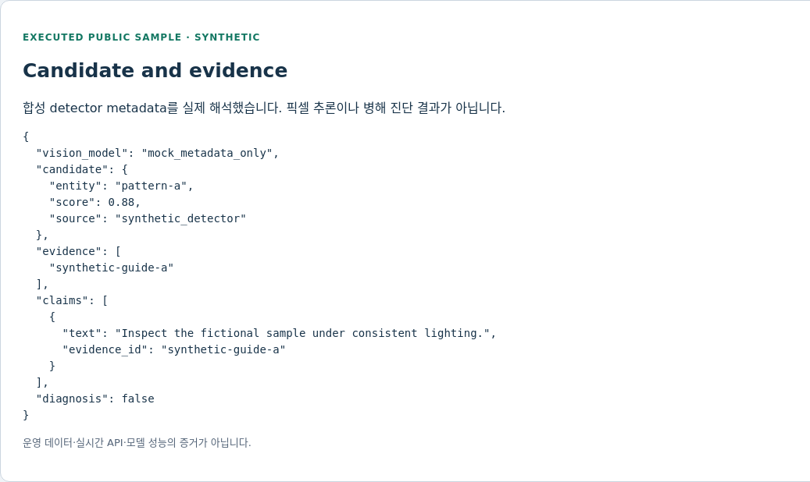
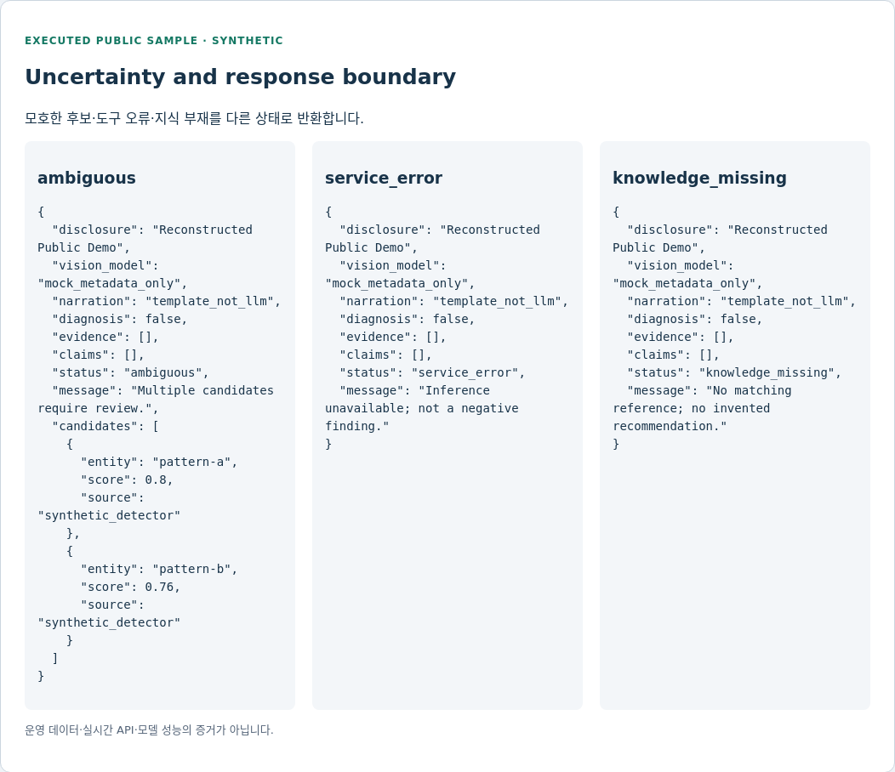

# Multimodal Domain AI

### Vision 후보를 Structured Knowledge와 연결하고, 불확실성을 답변에 남기는 설계

Vision × Structured Knowledge × Evidence × LLM

[](https://github.com/YeongjoonKim/multimodal-domain-ai/actions/workflows/ci.yml)

## 문제: 검출 결과는 곧 진단인가

높은 점수의 시각 후보가 나왔더라도 일치하는 지식이 없으면 근거 있는 권고가 되지 않습니다.
추론 서비스 오류는 “관측된 이상 없음”과도 다릅니다.
이 예제는 **후보 → 불확실성 검사 → 구조화 근거 → 응답 상태**의 연결 계약에 집중합니다.

현재 입력은 합성 detector metadata입니다. 이미지 픽셀, 실제 YOLO·LLM·모델 가중치는 실행하지 않습니다.
실제 이미지 진단 통합 경험을 공개 가능한 작은 예제로 재구성한 것이며 진단 제품을 공개한 것이 아닙니다.

This repository is a sanitized and reconstructed technical showcase based on engineering experience from a private production AI platform.
It does not contain proprietary source code, private data, internal APIs, or production configuration.

## Architecture


Reference: Image → Vision Model → Disease / Pest Candidate → Structured Knowledge
→ Evidence → LLM → Domain Response.

현재 공개 실행은 가상 `pattern-a / pattern-b` metadata 이후 구간에 한정합니다.
실제 병해충 이름·확률 교정·농약 처방은 포함하지 않습니다.

## 실행 증거 — Candidate / Knowledge / Response



- **무엇을 보여주는가:** 예제 함수가 실제 반환한 후보, knowledge ID, 근거가 연결된 claim.
- **현재 구현 범위:** 유한 score 검증, 엔티티 중복 제거, 일치하는 가상 지식 조회.
- **Known Limitation:** detector output을 합성했으며 픽셀 추론·실제 진단 카드가 아닙니다.
- **Research Relevance:** 후보 confidence와 지식 근거의 충족을 분리해 평가.

## Failure Handling / 불확실성 전달



- **무엇을 보여주는가:** ambiguous / service_error / knowledge_missing의 서로 다른 응답.
- **현재 구현 범위:** 경쟁 후보가 근접하면 추가 검토, 지식이 없으면 권고를 생성하지 않음.
- **Known Limitation:** threshold와 margin은 교육용 값이며 calibrated probability가 아닙니다.
- **Research Relevance:** 불확실성·외부 도구 실패·근거 부족을 답변 단계까지 보존.

[실제 JSON 출력](examples/execution.json) · [HTML 검토 문서](examples/execution.html) ·
[화면 범위](docs/screenshots.md). 모두 공개 예제를 실행한 기록이며 운영 관리자 캡처가 아닙니다.

## Tool Integration / Model Serving / API Design

| 구성 | 상태 | 공개 구현 |
|---|---|---|
| Candidate contract | IMPLEMENTED | entity / finite score / synthetic source |
| Uncertainty gate | IMPLEMENTED | low score, ambiguity, duplicate, service error |
| Structured Knowledge | PARTIAL | 두 가상 지식 record; live DB 아님 |
| Evidence response | IMPLEMENTED | claim과 fixture ID, diagnosis=false |
| Vision serving / LLM explanation / Upload API | PROPOSED | 모델·픽셀 입력·HTTP service 미포함 |

`interpret(candidates, service_status, threshold, margin)`는 in-process 함수입니다.
유효하지 않은 입력은 ValueError, 서비스 실패는 service_error로 구분합니다.
이를 실제 API에 연결할 때는 인증, 이미지 크기·형식 검증, timeout, 모델 revision,
전문가 확인 경로가 별도로 필요합니다. 설명 생성기는 현재 template입니다.

## Evaluation

20개 테스트는 malformed score, NaN/Infinity, 낮은 점수, 모호성, 미등록 지식,
중복 관측, 서비스 실패와 저장된 실행 문서의 재계산 일치를 확인합니다.
검출 mAP·진단 정확도·현장 성능 숫자는 측정하지 않았으므로 제시하지 않습니다.

[평가](docs/evaluation.md) · [설계 결정](docs/design-decisions.md) ·
[한계](docs/limitations.md) · [검증 기록](docs/validation.md).

## Reproduce

Python 3.10+ 표준 라이브러리. 기본 실행에서 모델 다운로드와 GPU 사용이 없습니다.

```sh
python3 -m src.vision_demo
python3 -m src.export_evidence
python3 -m src.render_evidence
python3 -m unittest discover -s tests -v
python3 scripts/check_repository.py
```

`src/`: 후보/근거 해석, `examples/`: 실행 결과, `tests/`: 회귀,
`docs/`: architecture와 검토 화면, `.github/`: CI.

## Limitation / Research Relevance

실제 detector와 전문 지식의 연결은 별도 검증이 필요합니다. 높은 score가 정확한 진단을
보장하지 않으며 no_observation도 건강함의 증거가 아닙니다.
라이선스가 확인된 이미지, out-of-distribution 사례, calibration, 사람의 확인을 포함해
candidate 수준과 최종 답변 수준의 오류를 따로 평가하는 것이 다음 단계입니다.

MY CONTRIBUTION: 시각 도구·지식·상담 통합 경험.
PLATFORM CONTEXT: 비공개 플랫폼. PUBLIC RECONSTRUCTION: 합성 metadata 계약.
FUTURE RESEARCH: 실제 모델과 다중모달 grounding 평가.

[공개 경계](PUBLICATION.md) · [License notice](LICENSE-NOTICE.md) · [Security](SECURITY.md).
