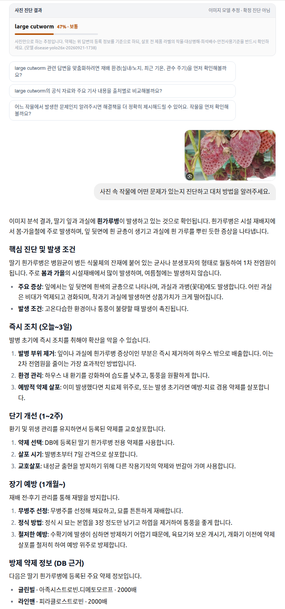

# Actual Consultation Screen

사용자가 제공하고 추가를 승인한 실제 상담 화면입니다.
README에는 딸기 사진 질문과 답변 구간을, 아래에는 앞선 턴의 카드가 포함된 넓은 구간을 제공합니다.
계정 표시와 주변 UI를 제외한 로컬 크롭이며 이미지 속 답변이나 수치는 변경하지 않았습니다.

## 화면이 보여주는 연결

1. 사용자가 사진과 자연어 질문을 함께 제출합니다.
2. 상담 답변에서 증상·조건과 즉시/단기/장기 대응 내용을 문단·목록으로 확인합니다.
3. 약제 정보는 별도 답변 섹션에 표시됩니다.
4. 별도 진단 카드와 후속 질문 제안이 대화 흐름에 표시됩니다.

작물·병해충 식별 결과에서 공식 등록정보 검색·상담으로 이어지는 구현은
[코드 대응 설명](actual-engineering.md)에 정리했습니다. 이 캡처는 해당 사용자 인터페이스의 사례이며,
아래 개별 답변의 검증 범위와 구분합니다.

## 턴 경계와 판정 범위

상단에는 `large cutworm` 카드와 후속 질문 제안이 있고, 그 다음에 딸기 사진·사용자 질문·흰가루병 설명이 나옵니다.
현재 화면 코드는 assistant 메시지 본문 다음에 해당 메시지의 진단 카드를 렌더링합니다.
배치상 상단 카드는 앞선 턴일 가능성이 있으므로, 두 내용을 같은 요청의 불일치로 단정하지 않습니다.
반대로 이 캡처에 딸기 답변의 진단 카드까지 보인다고 주장하지도 않습니다.
같은 턴의 정확한 연결을 입증하려면 message/request ID와 SSE·추론 기록을 함께 확인해야 합니다.

사진 답변의 단정적 표현, 계절 설명, 약제명·희석배수·살포 간격은 화면 기록으로 보존합니다.
화면에 “DB 근거”가 표시된 것만으로 실제 등록 행의 출처·기준일·대상 작물과 일치한다고 인증하지 않습니다.
독립 정답과 공식 행을 연결한 평가가 필요하며, 이 자료를 농업 처방 안내로 사용하지 않습니다.

## 공개 처리

- 원본은 보존하고 별도 RGB PNG 사본을 생성했습니다.
- 계정 표시·주변 UI를 제외했으며 텍스트 metadata를 제거했습니다.
- 이미지 내용의 진단명·수치·확정 표현을 수정하거나 재생성하지 않았습니다.
- [검토 hash](screenshots/manifest.json)로 공개 사본을 식별합니다.
